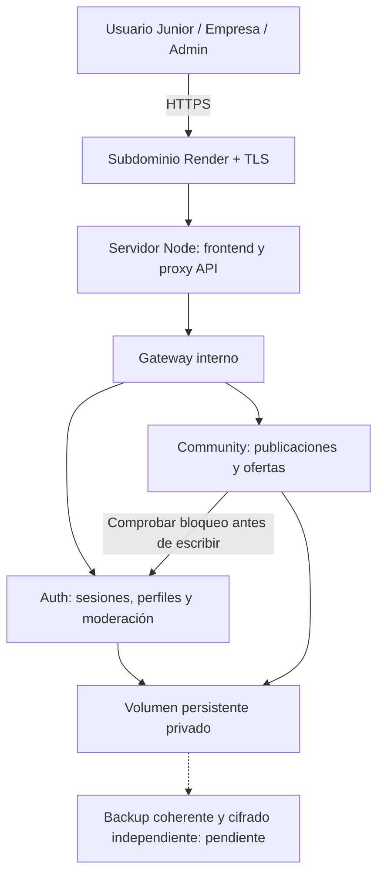

# Plan de despliegue de Junior Scope en la nube

Plan revisable del 7 de octubre de 2026. Incluye comunidad con imágenes, reacciones, comentarios, republicaciones, perfiles Junior/Empresa, denuncias y moderación. No autoriza contratar, pagar, crear recursos cloud, publicar ni transferir datos personales del portátil. No se ha reservado un nombre ni creado un despliegue.

## Propuesta y coste

Usar un servicio web de Render con el subdominio asignado por el proveedor bajo onrender.com y TLS gestionado gratuito. No hace falta comprar un dominio. El nombre exacto está sujeto a disponibilidad; Junior Scope es la marca del producto, no una reserva. [Servicios web de Render](https://render.com/docs/web-services), [TLS gestionado](https://render.com/docs/tls).

| Concepto | Propuesta | Situación |
| --- | --- | --- |
| Subdominio del proveedor | Nombre asignado bajo onrender.com | Sin compra de dominio; disponibilidad por comprobar. |
| Certificado HTTPS | Gestionado por Render | Gratuito según documentación revisada. |
| Alojamiento y disco persistente | Servicio suficiente para Node y volumen privado | Coste separado, pendiente de presupuesto y aprobación. |
| Backups y alertas | Almacenamiento independiente y monitorización | Proveedor, cuotas y coste pendientes. |

El requisito recibido es dominio gratuito. No se interpreta como autorización para pagar alojamiento ni como exigencia de que toda la infraestructura sea gratuita. La tarifa completa, impuestos, cuotas y límites se confirmarían antes de contratar.

Render Free pierde los cambios del filesystem local al reiniciar, redesplegar o suspenderse, no admite disco persistente y se suspende tras inactividad. Su Postgres gratuito caduca a los 30 días. Por eso **no se desplegará la SQLite actual sobre ese filesystem como servicio persistente de producción**. [Límites de Render Free](https://render.com/docs/free).

Koyeb Free tampoco proporciona volúmenes persistentes y está orientado a pruebas; no resuelve conservar esta arquitectura SQLite. [Instancias de Koyeb](https://www.koyeb.com/docs/reference/instances).

## Arquitectura inicial compatible

Un único servicio con Docker sin root: servidor Node de producción para frontend compilado y API en un mismo origen HTTPS; gateway, Auth y Community como procesos internos en loopback con autenticación interna. El volumen privado guarda auth.sqlite y community.sqlite, incluyendo imágenes y moderación.



Se conserva la separación de multiservicios REST, pero todos comparten una instancia. No equivale a aislamiento por máquinas, alta disponibilidad ni escalado horizontal. Solo una instancia mientras se utilice SQLite. Render limita un disco a una instancia y los despliegues con disco tienen interrupción temporal; se planifica mantenimiento, no disponibilidad continua. [Discos persistentes](https://render.com/docs/disks).

Si se necesitan instancias o servicios separados se presupuestarán los servicios privados y se migrará a una base gestionada. Las imágenes deberían pasar a almacenamiento de objetos privado para crecer. Esa migración no está implementada ni se inicia silenciosamente.

## Fases y criterios para avanzar

### 1. Inventario y control local

Ejecutar:

```powershell
npm.cmd ci
npm.cmd test
npm.cmd run build
npm.cmd run test:production
npm.cmd run check:security
npm.cmd audit --omit=dev
```

Revisar además el contenido preparado y el historial por secretos sin mostrarlos. El detector busca rutas privadas y formatos de claves conocidos: no es una auditoría exhaustiva. Mantener .env, bases, imágenes privadas, sesiones, backups y archivos de acceso fuera de Git y Docker. .gitignore/.dockerignore y hook local ya ofrecen una protección inicial.

Proponer repositorio privado y CI con permisos mínimos, dependencias fijadas por lockfile, revisión y checks antes de publicar. La privacidad del repositorio no sustituye excluir secretos. No se cambiará visibilidad ni se conectará el repositorio al proveedor durante esta fase de planificación. CI y políticas de rama están pendientes.

**Salida:** revisión de código y pruebas sin fallos, sin archivos privados preparados para subir y con límites del análisis documentados.

### 2. Preparar staging aislado

Tras aprobar proveedor y presupuesto, crear staging con datos sintéticos de prueba, nunca con una copia automática de las cuentas reales. Elegir una región europea cuando esté disponible y sea adecuada; la región por sí sola no acredita cumplimiento legal.

Variables propuestas, sin valores secretos en este documento:

```text
PUBLIC_ORIGIN=https://<subdominio-asignado>.onrender.com
INTERNAL_SECRET=<valor aleatorio privado diferente por entorno>
DATA_DIRECTORY=/app/data
HOST=0.0.0.0
PORT=<puerto proporcionado por la plataforma>
```

Guardar el secreto en la configuración privada del proveedor, nunca en VITE_ ni el bundle. Montar el disco en DATA_DIRECTORY y verificar que el UID sin root puede leer/escribir ese volumen y que sus permisos son privados. El puerto público sirve frontend/API; Auth, Community y gateway no se publican directamente.

Seleccionar administradores por un procedimiento explícito, sin contraseña inicial en Git. La cuenta local solicitada se ha comprobado como admin; eso no autoriza copiarla ni sus datos al cloud. Producción y staging tendrán bases, sesiones, secretos y administradores definidos separadamente.

**Salida:** despliegue de ensayo autorizado, con origen/cookie/TLS correctos, almacenamiento persistente y ninguna credencial en artefactos.

### 3. Seguridad antes de abrir a usuarios

| Control | Estado actual | Trabajo de lanzamiento pendiente |
| --- | --- | --- |
| Contraseñas | scrypt y sal aleatoria; hashes fuera de respuestas públicas | Revisar parámetros frente a carga y política; MFA/step-up en administración. |
| Sesiones | Tokens aleatorios, hash en SQLite, expiración, cierre de sesión y cookie Secure/HttpOnly/SameSite | Política de rotación y revocación global ante incidentes/cambios sensibles. |
| CSRF y acceso | Origin obligatorio en escrituras; mismo origen, sin CORS abierto; roles, tipo y propiedad en servidor | Repetir pruebas en el proxy/TLS reales y revisar cada nuevo endpoint. |
| Abuso | Límites por proceso, cuenta/IP, tamaño, imágenes, comentarios y denuncias | Protección de bots, cuotas globales y límites en proxy adaptados a tráfico real. No se promete WAF avanzado gratuito. |
| Respuestas | Texto escapado, SQL parametrizado, errores públicos genéricos, CSP/HSTS/nosniff/anti-frame/referrer-policy | Revisar CSP final, actualizaciones y pruebas de seguridad independientes. |
| Moderación | Denuncias, resoluciones, bloqueos, expiración, desbloqueo y auditoría persistentes | Política operativa de moderación, retención y revisión de casos. |
| Infraestructura | Docker no root y servicios internos autenticados | Validar imagen Docker, volumen, permisos reales, aislamiento y configuración del proveedor. |
| Cuentas del proveedor | No se han creado/configurado | MFA en GitHub/proveedor, mínimo privilegio y recuperación segura. |

Como referencia de revisión se utilizarán las guías de [gestión de sesiones de OWASP](https://cheatsheetseries.owasp.org/cheatsheets/Session_Management_Cheat_Sheet.html) y su Cheat Sheet Series. No se presenta el cumplimiento de estas guías como certificación.

### 4. Imágenes, consentimiento y privacidad

Actual: imágenes PNG/JPEG/WebP con límite de 500 KB, firma y formato permitidos, hasta cuatro por publicación/comentario. La lectura llega por endpoints autenticados que comprueban publicación/propiedad. No hay URLs públicas para saltarse permisos de borradores. Los perfiles se publican con consentimiento, y los datos de acceso no se incluyen en el directorio.

Pendiente antes de apertura pública: comprobar dimensiones y contenido completamente decodificable, recodificar imágenes y retirar metadatos; definir cuotas, retención y uso aceptable. La comprobación de firmas actual no equivale a recodificación ni antivirus. No se prometerá que retirar una publicación borre las copias que otros hayan descargado.

Implementar o definir exportación/borrado de cuenta y datos, retención de denuncias y consentimientos y política de privacidad revisada para juniors y empresas. Para crecer, usar objetos privados y metadatos en base gestionada, conservando autorización y expiración de accesos.

### 5. Continuidad y respuesta a incidentes

/health ya comprueba gateway, Auth y Community, con consulta básica de SQLite. Pendiente: monitorizar espacio, latencia, errores y abuso y activar alertas sin credenciales ni datos personales, con retención de logs definida.

Crear backups coherentes mediante API backup de SQLite o procedimiento seguro que contemple WAL; no copiar a ciegas los archivos de una base viva. Ambos servicios deben tener un procedimiento de respaldo/restauración coordinado. Cifrar los backups, almacenarlos fuera del disco original y limitar accesos. Propuesta inicial: copia diaria y pérdida máxima objetivo de 24 horas; es un objetivo por validar, no una garantía lograda.

Documentar y probar restauración y un runbook: revocar sesiones, rotar secretos, limitar escrituras, preservar evidencia, restaurar y notificar según corresponda. Backups, monitorización y servicios auxiliares pueden tener coste y requieren comprobar cuotas/presupuesto.

### 6. Puerta de lanzamiento

En staging, probar con dos usuarios y un administrador: perfiles y consentimiento, publicación con imágenes, reacciones, comentarios, atribución, denuncias y bloqueos. Intentar edición ajena y falsificación de roles; comprobar cookies, TLS, Origin y rutas privadas.

Probar conservación de cuentas/contenido tras restart/redeploy y una restauración real. Revisar permisos del volumen y artefactos de Docker. Desplegar inicialmente de forma manual y coordinar rollback con backup y compatibilidad de las migraciones; volver a una imagen antigua no revierte automáticamente una base modificada.

**Antes de contratar o desplegar:** presentar proveedor, nombre disponible, región, servicio/disco, presupuesto mensual con límites y medidas pendientes para aprobación. Sin importar automáticamente datos personales del portátil.

## Si también se exige alojamiento completamente gratuito

Habría que estudiar y verificar otro diseño con base y objetos persistentes externos dentro de cuotas gratuitas o migración serverless. Requiere adaptar Node/SQLite/multiservicios y comprobar pausas, facturación, recuperación y compatibilidad. No se promete gratuidad indefinida ni se escoge ese rediseño sin una decisión explícita.

La decisión pendiente es si se aprueba un presupuesto para alojamiento persistente conservando esta arquitectura, o se exige coste total cero y se autoriza estudiar una migración. El subdominio gratuito no resuelve el coste ni la persistencia del backend.

## Estado al entregar este plan

Ampliaciones sociales, publicación con consentimiento, moderación y alternancia administrativa implementadas localmente; pruebas de integración, componentes React, protección Git y servidor de producción correctas. Auditoría de dependencias de producción sin vulnerabilidades conocidas en la revisión. Revisar SECURITY.md para alcance y límites. No se ha publicado una URL cloud, contratado servicios ni transferido bases reales. La inspección de componentes no sustituye una validación visual completa en navegadores ni una auditoría externa.
# Estado del paquete de candidaturas y despliegue

Se implementaron candidaturas consentidas, retirada del perfil compartido, descartes personales, estados y mensajes privados con bandejas Junior/Empresa. Las pruebas locales de privacidad incluyen administradores ajenos y acceso cruzado. SQLite conserva estos datos en DATA_DIRECTORY.

Se añadió `deploy/render.example.yaml`, una propuesta pagada de una instancia Docker con disco persistente, origen configurable y secreto generado en proveedor. No se creó ningún recurso ni se importaron datos locales. El precio no está aprobado: el subdominio y el almacenamiento/cómputo deben distinguirse. La web de precios no ofreció una cifra comprobable para esta combinación en la lectura; se requiere cotización del panel antes de contratar.

Se añadió respaldo coordinado con servicios detenidos e integridad verificada; la restauración sintética pasa. Pendientes antes de apertura pública: ensayo de restauración/redeploy en proveedor, protección reforzada del acceso admin (MFA o control equivalente validado), procesamiento completo de imágenes, política de retención/borrado, monitorización y presupuesto/acceso al proveedor. La aprobación de presupuesto no sustituye esas comprobaciones.
