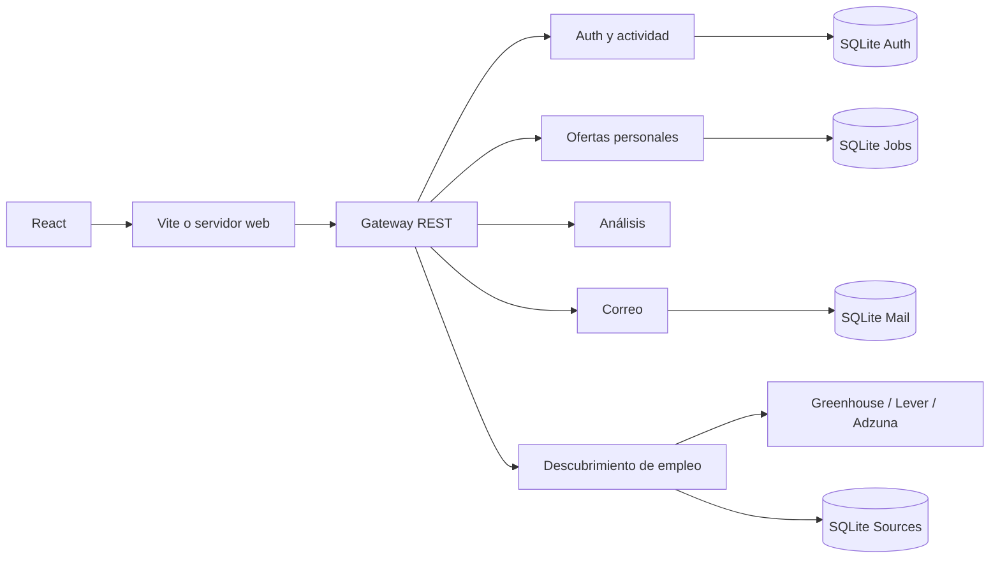

# TalentScope

Aplicación educativa de búsqueda de empleo, análisis de requisitos y seguimiento de candidaturas. Incluye un buscador de ofertas públicas, fichas de empresas, administración de usuarios, un dashboard de mercado y ejemplos interactivos de React.

Está construida con **React y varios servicios REST independientes en Node.js**, con persistencia SQLite. Tras completar el perfil obligatorio de currículum, el buscador consulta ofertas reales; no es una lista de datos ficticios.

## Estado actual

- Funciona en desarrollo local y tiene un servidor preparado para producción. El primer acceso exige analizar y confirmar un CV, también al administrador; necesita una clave privada de OpenAI configurada.
- Consulta portales públicos Greenhouse y Lever. Las fuentes iniciales son Stripe, Datadog y Canonical.
- Adzuna está implementado y requiere claves propias; LinkedIn OIDC y SMTP también necesitan configuración.
- El dashboard combina una muestra consultada de ofertas con una instantánea oficial documentada del INE.
- No está publicada automáticamente en Internet. El Dockerfile está preparado pero no se ha construido una imagen Docker en este entorno.
- La compilación y las pruebas REST están verificadas. La revisión visual automatizada del navegador no pudo completarse por restricciones del entorno.

## Finalidad educativa, investigación y originalidad

Esta aplicación **no es un intento de plagio**, ni pretende suplantar a LinkedIn, a los proveedores de empleo o a las empresas mencionadas. Su finalidad es educativa y de investigación: demostrar cómo construir interfaces React, servicios REST, autenticación, persistencia y visualizaciones que ayuden a estudiar oportunidades laborales.

Las marcas y contenidos de terceros pertenecen a sus titulares. Las ofertas conservan su fuente y enlace original; las fichas corporativas y estadísticas enlazan su procedencia. La imagen arquitectónica es un recurso generado decorativo, no la fotografía de una sede real. El fin educativo no sustituye el cumplimiento de licencias y condiciones de uso, ni supone una certificación legal de originalidad.

La motivación inicial plantea la hipótesis **«quien no encuentra trabajo es porque no se lo propone»**. El proyecto permite investigar la relación entre búsqueda activa, formación y oportunidades, pero **no demuestra esa afirmación**. La contratación también depende de experiencia, ubicación, condiciones, accesibilidad, situación económica y decisiones empresariales. El volumen de anuncios no mide la voluntad individual ni prueba causalidad sobre el desempleo.

## Cómo se ha construido

1. Separación de cuentas, ofertas guardadas, análisis y correo en procesos distintos.
2. Gateway REST que valida la sesión y coordina operaciones entre esos procesos.
3. Contraseñas con scrypt, sesiones HttpOnly, roles y datos aislados por propietario.
4. Interfaces React separadas para el espacio profesional, la cuenta y la administración.
5. Servicio de búsqueda que consulta proveedores y normaliza sus respuestas.
6. Procedencia, fecha de consulta y detección explicable de competencias y referencias educativas.
7. Historial de interacciones y panel protegido de administración.
8. Remodelación visual con buscador, tarjetas, filtros, pestañas, fichas corporativas y laboratorio React.
9. Dashboard de mercado y servidor de producción que sirve la interfaz compilada y la API bajo el mismo origen.

## Por qué es un multiservicio REST de Node.js

Cada servicio es un proceso Node.js, escucha en un puerto independiente y atiende una responsabilidad concreta. Las comunicaciones utilizan HTTP y JSON. Guardar una oferta puede implicar consultar su fuente, persistirla, analizarla y preparar una notificación, sin mezclar todas esas tareas en un único manejador.

Node.js permite compartir lenguaje con React y consultar APIs con `fetch`. REST ofrece métodos, rutas y estados HTTP explícitos. La separación facilita cambiar proveedores y probar funciones sin mezclar la búsqueda de empleo con contraseñas o SMTP.



La versión actual ejecuta esos procesos en una misma máquina o contenedor. **No es una plataforma distribuida con orquestación o escalado independiente por host.** Los servicios internos escuchan en loopback y exigen una clave interna. Separarlos físicamente requeriría configuración de red, URLs de servicios y otra estrategia de persistencia.

| Servicio | Puerto local | Responsabilidad |
|---|---:|---|
| Gateway | 4100 | Sesión, origen, límites de peticiones y coordinación |
| Auth | 4101 | Cuentas, roles, perfiles, sesiones, OIDC y actividad |
| Jobs | 4102 | Ofertas personales y estados de candidatura |
| Analysis | 4103 | Coincidencia y explicación de competencias |
| Mail | 4104 | SMTP e historial de entrega |
| Discovery | 4105 | Fuentes externas, caché y mercado observado |
| Vite | 5173 | Desarrollo de las interfaces |
| Web de producción | `PORT`, por defecto 3000 | Interfaz compilada y proxy de `/api` |

## Tecnologías utilizadas

| Tecnología | Uso |
|---|---|
| Node.js 24, módulos ES y HTTP nativo | Servicios REST; no se usa Express |
| React 19 y React DOM | Componentes, estado, efectos y renderizado |
| Vite 7 | Desarrollo y compilación de tres entradas React |
| CSS responsive y Lucide React | Diseño, componentes, iconos e interacciones |
| SQLite con `node:sqlite` y WAL | Persistencia separada por servicio |
| `node:crypto` | scrypt, sales, tokens aleatorios y hashes de sesión |
| JOSE | Validación criptográfica de tokens OIDC |
| Nodemailer | Envío SMTP con TLS |
| `node:test` y `assert` | Pruebas de lógica y flujos REST |
| Dockerfile y servidor Node de producción | Preparación del despliegue completo |

SQLite puede emitir un aviso experimental en la versión de Node utilizada. No se usa IA generativa para investigar cualquier empresa ni un modelo predictivo de contratación.

## Funcionalidades

### Buscar ofertas reales

- Palabras del puesto/descripción y ubicación; filtros por empresa conectada.
- Adzuna como fuente alternativa, con búsqueda por país cuando se configuran sus claves.
- Búsquedas rápidas, resultados paginados y estado explícito de cada fuente.
- Caché de cinco minutos, máximo de 15 portales y hasta 2.000 anuncios por portal en una consulta.
- Deduplificación por enlace o identificador de origen.
- Ficha por pestañas: puesto y requisitos, encaje personal y empresa/contacto.
- Salarios estructurados cuando se publican; los predichos por el proveedor se identifican como estimaciones.
- Guardado en el espacio personal sin duplicar la misma oferta externa.
- Botón de candidatura que abre la web original; no presenta solicitudes automáticamente.

Las fuentes iniciales son empresas internacionales y contienen puestos de varias ocupaciones. No representan todas las ofertas de España ni todo el sector tecnológico. Las búsquedas coinciden con el texto original, sin traducción semántica automática. Adzuna proporciona descripciones resumidas, señaladas como tales.

### Empresas, sedes y contactos

Las fichas iniciales contienen actividad, web, direcciones documentadas, fecha de consulta y canales públicos. Se distingue una sede de un domicilio social o dirección de correspondencia.

Datadog tiene teléfono y correo de consultas generales documentados; **no se presentan como contactos de selección**. Si no existe teléfono o correo contrastado, se indica la ausencia. Un botón `mailto:` abre el cliente de correo del usuario, no envía mensajes automáticamente. No se inventan números de empleados.

Los perfiles están documentados en `services/company-data.mjs`. No son una investigación automática universal: otras empresas pueden aparecer sin ficha contrastada.

Fuentes: [Stripe](https://stripe.com/about), [Datadog — contacto](https://www.datadoghq.com/about/contact/), [Canonical — actividad](https://canonical.com/company), [Canonical — direcciones](https://canonical.com/legal/companies).

### Cuenta, análisis y candidaturas

- Registro, inicio y cierre de sesión; contraseña mínima de 10 caracteres.
- Perfil de competencias y Premium declarado por el usuario, no verificado por LinkedIn.
- Coincidencia exacta de competencias normalizadas, con pesos iguales.
- Detección de competencias importadas mediante vocabulario técnico: puede omitir requisitos o detectar menciones no obligatorias.
- Extracción de frases sobre formación, conservando referencias a preferencias o experiencia equivalente.
- Guardar, editar, buscar, filtrar y eliminar ofertas.
- Estados guardada, solicitud enviada, entrevista y cerrada. Cambiarlos solo registra lo declarado por el usuario.
- Solicitantes y plazas solo cuando el usuario aporta esos datos.

La afinidad **no es una probabilidad de obtener el empleo**. Tampoco se calcula el salario medio por titulación: faltan datos representativos de experiencia, país y resultados. Los salarios mostrados pertenecen a una oferta o a una estimación identificada del proveedor, no son ingresos garantizados.

### Correo y LinkedIn

Al guardar/importar una oferta se prepara una notificación si está habilitada. También hay envío manual e historial. Sin SMTP, aparece como vista previa/no enviada; con SMTP se registra el resultado real. No existe cola duradera ni reintento automático.

LinkedIn OAuth/OIDC es opcional y necesita una aplicación registrada. Verifica firma, issuer, audience, state, nonce y caducidad. No concede acceso al catálogo de empleo, solicitantes ni estado Premium. No usa scraping, cookies de LinkedIn ni su contraseña.

El plugin LinkedIn disponible en esta conversación ofrece búsqueda de profesionales, no una herramienta de catálogo de empleos. Conectarlo al chat no entrega sus credenciales a nuestra aplicación ni amplía automáticamente los permisos OIDC.

### Administración

Usuarios paginados, búsqueda por nombre/correo, roles, fechas de alta y último acceso, métricas e historial por persona. Solo los administradores pueden consultar el panel o modificar fuentes; el servidor verifica el rol y no depende únicamente de ocultar botones.

Se registran altas, accesos, visitas, búsquedas, cambios de perfil, operaciones de ofertas, análisis, notificaciones y modificaciones de fuentes. El registro empieza con la implantación del historial; no reconstruye actividad anterior. Las consultas automáticas de análisis también pueden generar eventos. Una sesión vigente no demuestra presencia en ese instante.

No se devuelven contraseñas, hashes, sales, tokens o contenido de correos en la administración.

### Ejemplos React

Botón con estado, pestañas para ver/copiar código, selector de color, contador, selección múltiple, acordeón, modal y avisos. Funcionan con estado React y están identificados como demostraciones: no modifican candidaturas ni el perfil real.

## Dashboard: situación laboral

La pestaña **Mercado laboral** distingue:

1. **Muestra consultada:** anuncios únicos de los portales, empresas, referencias a remoto, distribución por empresa/ubicación y menciones de competencias. Se consulta al actualizar, respetando la caché.
2. **Contexto oficial nacional:** una instantánea de la EPA, segundo trimestre de 2026, consultada el 7 de octubre de 2026. No se actualiza automáticamente desde el INE.

| Indicador oficial | Valor | Alcance |
|---|---:|---|
| Personas ocupadas | 22.779.000 | España, toda la economía |
| Personas desempleadas | 2.495.300 | España, toda la economía |
| Tasa de paro | 9,87 % | España, toda la economía |

Fuente: [INE — EPA del segundo trimestre de 2026](https://www.ine.es/dyngs/Prensa/es/EPA2T26.htm). Para contexto sectorial, se enlaza el [informe de tendencias del SEPE](https://www.sepe.es/HomeSepe/que-es-observatorio/tendencias-del-empleo/Informes-Tendencias-del-Mercado-de-Trabajo.html).

Las APIs no proporcionan candidatos únicos, por lo que esa magnitud figura como **no disponible**, no como cero. Un anuncio no equivale necesariamente a una plaza, y una persona puede solicitar varios puestos. Demanda empresarial, personas buscando empleo, solicitantes y desempleados son conceptos distintos. No se divide el paro nacional entre anuncios internacionales para producir una ratio engañosa.

Estudiar causalidad o resultados de búsqueda requeriría seguimiento consentido de cohortes, resultados de selección y control de factores externos. El dashboard actual es descriptivo y no demuestra la hipótesis sobre la motivación individual.

## Ejecutar en Windows

Requiere Node.js 24 o superior e Internet para consultar las fuentes.

```powershell
cd "C:\Users\Rubén\Documents\Codex\2026-10-07\c8\outputs\talent-scope"
npm.cmd install
npm.cmd run dev
```

Abre `http://127.0.0.1:5173/` y deja la terminal abierta. Se aceptan los orígenes locales `localhost` y `127.0.0.1` en el mismo puerto. `npm.cmd` evita el bloqueo de `npm.ps1` sin cambiar la política de PowerShell.

Tras modificar el backend, pulsa Ctrl+C y vuelve a arrancarlo: Vite actualiza React, pero no reinicia los procesos REST.

```powershell
npm.cmd run build
npm.cmd test
npm.cmd audit --omit=dev
```

Las pruebas cubren afinidad, orígenes, permisos, aislamiento, prevención de autoasignación de admin, ausencia de secretos, normalización, deduplicación, fuentes y mercado. Usan respuestas controladas para los proveedores y OpenAI. Incluyen lectura de PDF/DOCX/TXT, aceptación, bloqueo de primer acceso, selección de conceptos, aislamiento y eliminación del perfil del CV. La conectividad real de los tres portales iniciales se verifica por separado. No equivalen a validar una llamada real a OpenAI con saldo, SMTP, LinkedIn, Adzuna con claves o el alojamiento final.

## Configuración y credenciales

Copia `.env.example` a `.env` y configura únicamente los servicios necesarios.

| Variable | Uso |
|---|---|
| `PUBLIC_ORIGIN` | Origen de la app; necesario en producción salvo URL externa del alojamiento |
| `INTERNAL_SECRET` | Clave interna, generada al iniciar si falta |
| `ADZUNA_APP_ID`, `ADZUNA_APP_KEY` | API de Adzuna |
| `LINKEDIN_CLIENT_ID`, `LINKEDIN_CLIENT_SECRET`, `LINKEDIN_REDIRECT_URI` | Identidad OIDC |
| `SMTP_HOST`, `SMTP_PORT`, `SMTP_USER`, `SMTP_PASS`, `SMTP_FROM` | Correo real |
| `DATA_DIRECTORY` | Carpeta persistente de SQLite |
| `PORT` | Puerto público del servidor de producción |

No expongas secretos como variables `VITE_`. El navegador no recibe claves de proveedores. El puerto SMTP 587 exige STARTTLS; 465 usa TLS directo. Configura exactamente el callback de LinkedIn para el origen final.

Para crear o restablecer un administrador:

```powershell
node services/bootstrap-admin.mjs TU_CORREO
```

La contraseña aleatoria se guarda en `data/admin-access.txt` o en `DATA_DIRECTORY`, y en SQLite solo se almacena el hash. El comando invalida las sesiones anteriores. No lo repitas salvo que quieras cambiar esa contraseña. `.env`, bases de datos y archivo de acceso están excluidos de Git y de la imagen Docker.

## API principal

| Ruta | Función |
|---|---|
| `POST /api/auth/register`, `/login`, `/logout` | Cuenta y sesión bajo `/api/auth` |
| `GET /api/auth/me`, `PATCH /api/auth/profile` | Perfil |
| `GET /api/discover/search` | `q`, `location`, `company`, `provider`, `country`, `page` |
| `GET /api/discover/offer?id=...` | Ficha del proveedor |
| `POST /api/discover/import` | Guardar por identificador externo |
| `GET/POST /api/discover/sources`, `DELETE /api/discover/sources/:id` | Fuentes; mutaciones solo admin |
| `GET /api/companies/info?name=...` | Ficha corporativa documentada |
| `GET /api/market/overview` | Mercado observado |
| `GET/POST /api/jobs`, `GET/PATCH/DELETE /api/jobs/:id` | Ofertas propias |
| `GET /api/jobs/:id/analysis`, `POST /api/jobs/:id/notify` | Análisis y correo |
| `GET /api/mail/history` | Historial propio |
| `GET /api/admin/overview` | Usuarios/actividad, solo admin |
| `POST /api/activity` | Visita a una página permitida |

## GitHub y despliegue

Consulta [DEPLOY.md](DEPLOY.md) para subir y desplegar desde GitHub. GitHub Pages sirve archivos estáticos y no ejecuta esta arquitectura completa. El servidor de producción sirve `dist/` y la API en un origen; SQLite requiere persistencia y una sola instancia en esta configuración.

Sites usa un entorno de ejecución distinto del servidor Node con procesos y SQLite local. Publicar allí la aplicación completa requeriría adaptar backend y almacenamiento; publicar únicamente la interfaz no sustituye esa adaptación.

Antes de uso público amplio faltan verificación de email, recuperación de contraseña, política de privacidad, retención de actividad, backups consistentes, pruebas de carga, revisión visual/accesibilidad y seguridad. La guía prepara el despliegue, no certifica que ya se haya realizado.

## Referencias técnicas

- [Greenhouse Job Board API](https://docs.greenhouse.io/job-board.html)
- [Lever Postings API](https://github.com/lever/postings-api)
- [Adzuna API](https://developer.adzuna.com/)
- [LinkedIn — permisos](https://learn.microsoft.com/en-us/linkedin/shared/authentication/getting-access)
- [LinkedIn — OIDC](https://learn.microsoft.com/en-us/linkedin/consumer/integrations/self-serve/sign-in-with-linkedin-v2)

### Filtro de país y símbolos de empresa

El buscador permite combinar país, ciudad, puesto y empresa. En los portales conectados se reconocen países y ciudades a partir de la ubicación publicada; las ofertas remotas sin país explícito quedan disponibles en «Todos los países». Adzuna usa el país de su catálogo. Los iconos de las empresas representan su actividad (infraestructura, monitorización y pagos); no son logotipos oficiales.

### Finalidad del directorio de empresas

«Empresas» reúne las empresas de las fuentes conectadas y las ofertas guardadas, excluyendo la ficha ficticia del directorio. Permite abrir su contexto corporativo y buscar sus puestos. Cada oportunidad incluye descripción y enlace original, además de una ficha corporativa que distingue datos publicados y desconocidos. Las fichas de Canonical, Datadog y Stripe son resúmenes de fuentes oficiales fechadas; las empresas nuevas requieren incorporar fuentes contrastadas. No se garantiza información absoluta ni actualización automática de estas fichas. La consulta de la empresa y la oferta se resuelve por separado para conservar la información disponible si una fuente falla.

## Currículum obligatorio y análisis de IA

Al acceder por primera vez, tanto usuarios como administradores deben subir su CV, aceptar las condiciones y autorizar expresamente su análisis por OpenAI. Se admiten PDF con texto (hasta 30 páginas), DOCX y TXT UTF-8, hasta 5 MB y 40.000 caracteres. No se realiza OCR: un PDF escaneado o protegido puede necesitar conversión.

El servicio de autenticación procesa el archivo en memoria. Envía el texto al endpoint Chat Completions de OpenAI con salida JSON estructurada y almacenamiento de respuesta desactivado. Se ocultan patrones de correo y teléfono; esto no constituye anonimización. No se guardan el archivo ni el texto completo. La clave nunca sale del servidor.

La IA propone conceptos técnicos, herramientas, métodos, idiomas y formación con una evidencia literal. Se descartan evidencias que no aparecen en el texto. El usuario revisa y selecciona los conceptos; solo después se actualizan sus competencias. La afinidad posterior continúa siendo una comparación explicable con los requisitos del puesto, no una predicción de contratación ni una evaluación de personalidad. Las competencias pueden corregirse después en Mi cuenta.

Se guardan conceptos y evidencias breves, modelo, fechas, versión de condiciones y huella SHA-256 del archivo. El borrador caduca a los 30 minutos y se purga en el siguiente acceso a la cuenta. Se conservan registros de aceptación y eventos sin el CV. Mi cuenta permite actualizar el CV o eliminar los conceptos y su afinidad; tras eliminarlos se solicita de nuevo completar el perfil. No borra ofertas guardadas, backups existentes ni solicitudes ya enviadas al proveedor.

La API bloquea los datos de la aplicación con HTTP 428 hasta confirmar el CV. Cambiar resumeCompleted desde el cliente no permite saltarse el flujo. Los análisis se limitan a cinco por usuario y hora y uno en curso.

Configuración privada en .env (no usar variables VITE_):

```dotenv
OPENAI_API_KEY=TU_CLAVE_PRIVADA
OPENAI_CV_MODEL=gpt-4.1-mini
PRIVACY_CONTROLLER=Nombre del responsable del servicio
PRIVACY_CONTACT=Contacto para privacidad
```

Sin clave, el flujo muestra un estado pendiente y no simula IA. La API de OpenAI requiere acceso y saldo propios. Reinicia el servidor después de configurarla.

Endpoints autenticados: GET /api/auth/cv/policy, POST /api/auth/cv/analyze, POST /api/auth/cv/confirm y DELETE /api/auth/cv.

Las condiciones son un texto inicial para el proyecto educativo. La aceptación no exime de obligaciones legales: antes de publicar se debe completar la información del responsable, base jurídica, conservación, derechos y las condiciones del proveedor aplicables. Separar la lectura de condiciones y la autorización permite registrar ambas acciones de forma explícita. Consulta la [orientación de la AEPD sobre consentimiento e información](https://www.aepd.es/preguntas-frecuentes/2-tus-obligaciones-como-responsable-del-tratamiento/6-el-deber-de-informacion/FAQ-0248-sobre-si-el-usuario-tiene-que-dar-consentimiento-a-clausula-de-privacidad). OpenAI puede conservar registros de supervisión de abuso: store=false no implica retención cero; consulta sus [controles de datos](https://developers.openai.com/api/docs/guides/your-data).
